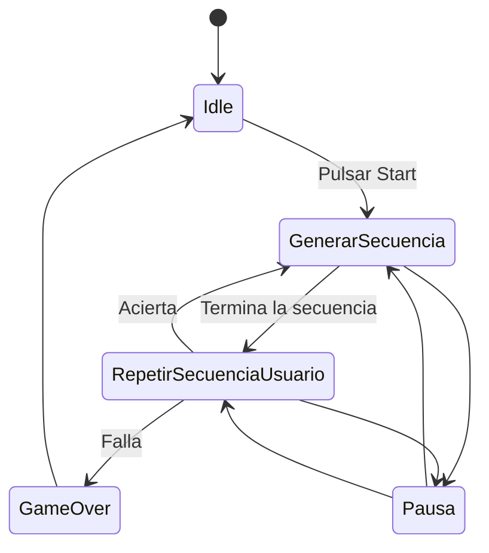

# Diagrama de Estados del Juego "Simón Dice"

```mermaid
stateDiagram-v2
direction TB

[*] --> Idle
Idle --> GenerarSecuencia : Pulsar Start
GenerarSecuencia --> RepetirSecuenciaUsuario : Termina la secuencia
RepetirSecuenciaUsuario --> GenerarSecuencia : Acierta
RepetirSecuenciaUsuario --> GameOver : Falla
GenerarSecuencia --> Pausa
RepetirSecuenciaUsuario --> Pausa
Pausa --> GenerarSecuencia
Pausa --> RepetirSecuenciaUsuario
GameOver --> Idle

```